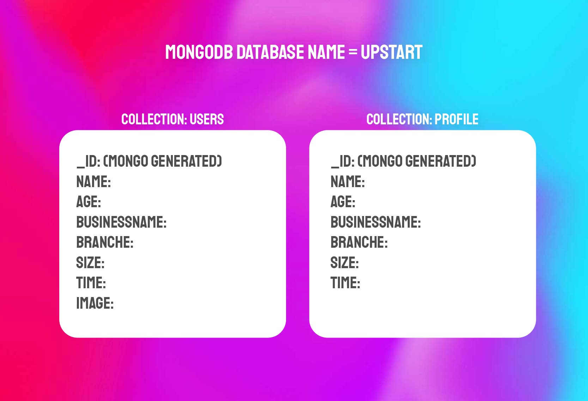

# About UpStart

UpStart is een online platform gericht op jonge ondernemers van 18-34 jaar. De app helpt je bij het vinden van ondernemers uit jouw branche. Zo kan je samenwerkingen aangaan, advies verkrijgen en samen verder groeien. De naam UpStart komt van een bekende term uit de doelgroep: 'Start-Up'.

UpStart vormt een kickstart voor elke jonge ondernemer. Je geeft in de app aan in welke branche je werkt, hoe lang je hierin onderneemt, in welke fase je zit met je onderneming en hoe groot je onderneming is. Aan de hand van een intuïtieve swipe functie kan je kiezen welke ondernemer bij jouw past voor een eventuele samenwerking.

## Install
Clone deze repository naar jouw lokale folder
```git
git clone https://github.com/robbinux/matching-app-blok-tech.git
```
<br>

Installeer de bijbehorende packages
```js
npm install
```
<br>

Stel jouw database gegevens in (MongoDB)
```js
DB_URI= mongo link
```




<br>

Als je de database hebt ingesteld, start je de server:
```js
npm start
```

## Bijdragen
Als je wilt bijdragen aan deze app kun je dat doen door middel van een [Issue](https://github.com/CMD-JOBS/CMD-JOBS/issues).

Zie ook:
* [CONTRIBUTING](https://github.com/robbinux/matching-app-blok-tech/blob/main/CONTRIBUTING.md)
* [CODE OF CONDUCT](https://github.com/robbinux/matching-app-blok-tech/blob/main/CODE_OF_CONDUCT.md)

## License

Usage is provided under the MIT License . See [LICENSE](https://github.com/robbinux/matching-app-blok-tech/blob/main/LICENSE) for the full details.
